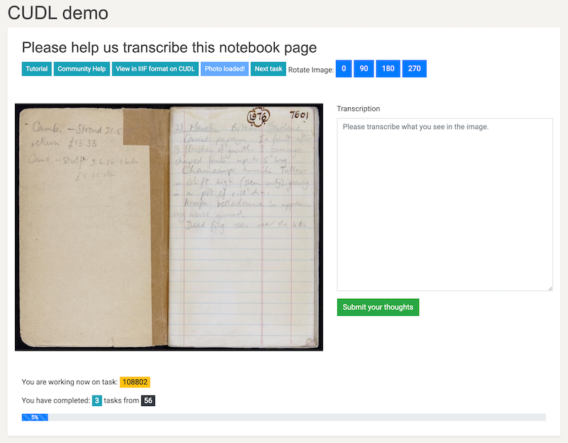

The University Library has a [Github based transcription](https://github.com/Cambridge-Digital-Library/Crowdsourcing/issues)
exercise using its IIIF manifests and images of the [Oliver Rackham diaries](https://cudl.lib.cam.ac.uk/collections/rackham/1). A simple demo of how this could be done in MicroPasts was built in about 10 minutes during a CDH Methods Fellows Show and Tell.

### Pre-requisites for set up

1. Register on the platform
2. Have access to a Rackham diary in **valid** IIIF format and the url for the manifest

In the above pre-requisites, the word **VALID** is really important; at the time of writing
the UL's IIIF manifests have invalid character, attributes and tags in their markup - specifically for

* abstract
* description

Due to this, the IIIF validator will say no and the import of data will fail. The below is an example element with invalid markup for https://cudl.lib.cam.ac.uk/iiif/MS-CCCC-00014-00006-00002-00001-00230

#### Invalid manifest element

```json
{
   "label": "Abstract",
   "value": "<p style='text-align: justify;'> Locations featured include: Great Waldingfield <a href=''
    onclick='store.loadPage(2);return false;'>17865<\/a>, Wimpole Avenues <a href=''
    onclick='store.loadPage(4);return false;'>17869-70<\/a> and <a href=''
    onclick='store.loadPage(7);return false;'>17875-7904<\/a>, Hockham lime-grove <a href=''
    onclick='store.loadPage(6);return false;'>17872<\/a>, Merton Park <a href=''
    onclick='store.loadPage(6);return false;'>17873<\/a>, Wandlebury (drought) <a href=''
    onclick='store.loadPage(30);return false;'>17921-27<\/a>, Benacre Park <a href=''
    onclick='store.loadPage(26);return false;'>17912<\/a>, Crane's Wood, Benhall <a href=''
    onclick='store.loadPage(27);return false;'>17915<\/a>, Redisham Park <a href=''
    onclick='store.loadPage(28);return false;'>17916<\/a>, Thorington Big Wood and Blythburgh Haw Wood <a
    href='' onclick='store.loadPage(29);return false;'>17919<\/a> and Norwich <a href=''
    onclick='store.loadPage(35);return false;'>17930-32<\/a>. <\/p>"
  }
```

#### Valid manifest element

If this is cleaned (and the description element to:

```json
{
   "label": "Abstract",
   "value": "Locations featured include: Great Waldingfield 17865, Wimpole Avenues
   17869-70 and 17875-7904 Hockham lime-grove 17872 Merton Park 17873 Wandlebury
   (drought) 17921-27 Benacre Park 17912 Crane's Wood, Benhall 17915 Redisham
   Park 17916 Thorington Big Wood and Blythburgh Haw Wood 17919 and Norwich
   17930-32."
  }
```

  So for this example - a cleaned manifest file is to be found at:

  https://fitz-cms-images.s3.eu-west-2.amazonaws.com/ms-cccc-00014-00006-00002-00001-00227.json

  You will need this link later on in this tutorial.

### Setting up a project

Now you are registered and have access rights you are in the position to create
an instance of a IIIF transcription and annotation project. The CUDL template
source code for this project can be found in the [theme repository](https://github.com/MicroPasts/MicroPasts-pybossa-theme/blob/master/templates/projects/snippets/cudl.html)
in the snippets directory.

!!! question "How do I open this page?"

    Admin rights are required to access this page.

1. Go to https://crowdsourced.micropasts.org/project/new and you will see this form:

2. Fill in the following attributes
   1. Name for the project - eg. Rackham Great Waldingfield
   2. A short name for the project - eg rackham17865
   3. A long description of the project - what do you want to do? This is your
   first call to action - using markdown.
3. Press create and you will be redirected to the update settings page, which will look like this:

4. Upload an image for the header and logo for the project.
   1. Press choose file
   2. Navigate to image file
   3. Crop or resize the image to your desire (within reason)
   3. Press upload
5. Select a project category, save and then don't touch anything else for now.

### Building the framework

This is super easy! We have a template project, a descriptive and visual intro and a data URI for import of tasks. So let's get going.

##### Task presenter

1. Click on tasks in the secondary nav menu
2. Choose task presenter
    1. Now you're in the interface to choose your project type. Scroll until you find: **CUDL IIIF projects** as a template
    
    2. Press go
    3. This now renders the code for the interface - you can adapt this if you   want to here, it is just HTML 5, css and javascript.
    
    4. Press update

##### Basic tasks import

You now have a template project, but no data. Let's fix that!

1. On the tasks page press the import tasks button
2. Scroll down and look in the second column for IIIF

3. Paste a validated manifest URI into the url box eg https://fitz-cms-images.s3.eu-west-2.amazonaws.com/ms-cccc-00014-00006-00002-00001-00227.json in the box (choose presentation API 2.1)
4. Press import
5. Your project now has tasks!

#### Testing and publishing

You can now test the project via the 'Test it!' button.

1. Does a task appear? You should see an interface like this:

2. If it does, try and annotate the image by dragging and drawing
3. Try and transcribe the text
4. Submit your transcription.
5. If this works, then you can publish the project.

### Task admin

You now want to configure the task settings. This is based on the usual questions:

* How many times do you want contributors to participate? 2, 3 or more? Go to tasks > settings > redundancy and set the number you want.
* How do you want to deliver tasks? Breadth (returns a task which has the least number of task runs (answers) excluding the current user), Random or Default (in sequence)? Go to tasks > settings > task scheduler and set the method of delivery.
* Do you want some tasks to be golden or high priority? Go to tasks > settings > priority and set the factors you want for the ids of the tasks

### Project admin

**Viewing task progress**: You can see how tasks are progressing easily, and download each individual task's data
directly from the tasks interface. To do this go to tasks > browse tasks and if you want to see data being entered click download task results.
**Ownership**: You can share ownership of the project with other users, which allows you to administer
the task settings and other options. To add a co-owner, go to settings > coowners and search for the user you want to add.
**Project report**: To download a CSV report for the project go to settings and export report.

### Extracting data

Like all MicroPasts projects, we tend to use scripting languages like Python or R to manipulate the data and redisplay or analyse. This uses the PYBOSSA API and export of user data to build your data analysis up. An example of how to do this with R is below:

```R
#' ----
#' title: " A script for manipulation of the Montpelier crowdsourcing project
#' author: "Daniel Pett"
#' date: "12/03/2021"
#' output: csv_document
#' ----
#'
#'

# Set the project name - When you change this to the project slug you choose which one to get
# data for.
project <- 'cudl'

# Create path string
pathToDir <- paste0("~/Documents/research/micropasts/analysis/",project)

#Check if this path exists, if not create it.
if (!file.exists(pathToDir)){
  dir.create(pathToDir)
}

# Set working directory (for example as below) This is for OSX. Change for your platform
setwd(pathToDir) #MacOSX

# Create CSV directory if does not exist
if (!file.exists('csv')){
  dir.create('csv')
}

# Create archives directory if does not exist
if (!file.exists('archives')){
  dir.create('archives')
}

# Create JSON folder
if (!file.exists('json')){
  dir.create('json')
}

# Add necessary libraries
library(jsonlite)
library(stringr)

# Load user data
# http://crowdsourced.micropasts.org/admin/users/export?format=csv (when logged in as admin)
# This saves as all_users.csv and put this in the csv folder

users <- read.csv('csv/all_users.csv', header=TRUE)
users <- users[,c("id","fullname","name")]


# Set the base url of the application
baseUrl <- 'http://crowdsourced.micropasts.org/project/'

# Set the task runs api path
tasks <- '/tasks/export?type=task&format=json'

# Form the export url
url <- paste(baseUrl,project, tasks, sep='')
archives <- paste('archives/',project,'Tasks.zip', sep='')

# Import tasks from json, this method has changed due to coding changes by SciFabric to their code
download.file(url,archives)
unzip(archives)
taskPath <- paste('json/', project, '.json', sep='')
rename <- paste(project, '_task.json', sep='')
file.rename(rename, taskPath)

# Read json files
which(lapply(readLines(taskPath), function(x) tryCatch({jsonlite::fromJSON(x); 1}, error=function(e) 0)) == 0)
trT <- fromJSON(paste(readLines(taskPath), collapse=""))
trT <- cbind(trT$id,trT$info)
trTfull <- trT

# extract just task id and image URL, title
trT <- trT[,c(1,2)]
names(trT) <- c("taskID","url_b")

# Import task runs from json
taskruns <- '/tasks/export?type=task_run&format=json'
urlRuns <- paste(baseUrl,project, taskruns, sep='')
archiveRuns <-paste('archives/', project, 'TasksRun.zip', sep='')
download.file(urlRuns,archiveRuns)
unzip(archiveRuns)
taskruns <- paste('json/', project, '_task_run.json', sep='')
renameRuns <-paste(project, '_task_run.json', sep='')   
file.rename(renameRuns, taskruns)

# Read the JSON
json <- fromJSON(taskruns)

# Read the transcription data
transcriptionEntry <- json$info
resultsCount <- nrow(json)
data <- NULL
# Ignore first 3 entries as they were junk
for (a in 3:resultsCount){
  test <- as.data.frame(json$info$table[a])
  test$DEcode <- json$info$deCode[a]
  test$pageNumber <- json$info$pageNumber[a]
  test$siteNumber <- json$info$siteNumber[a]
  test$taskID <- json$task_id[a]
  test$userID <- json$user_id[a]
  data <- rbind(data, test)
}
# Enforced to UPPER
data <- as.data.frame(sapply(data, toupper))

# Set up user details
names(users) <- c("userID", "fullname")
final <- merge(data, users, by="userID", all.x=FALSE)

# Merge for file paths to be added by line
final <- merge(named, trT, by="taskID", all.x=FALSE)

# Here you label the column names that you want for your csv file header row
colnames(final) <- c()


# Create a name and path for your csv file
csvname <- paste0('csv/', project, '.csv')
# Write the csv file to your path
write.csv(final, file=csvname, row.names=FALSE, na="")

```
